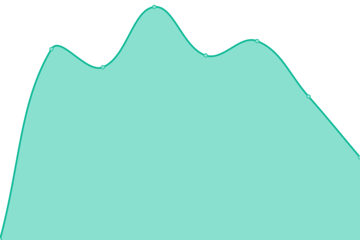

# [📈 Live Status](https://elightcap.github.io/statuspage): <!--live status--> **🟩 All systems operational**

This repository contains the open-source uptime monitor and status page for [elightcap](https://elightcap.github.io/statuspage), powered by [Upptime](https://github.com/upptime/upptime).

With [Upptime](https://upptime.js.org), you can get your own unlimited and free uptime monitor and status page, powered entirely by a GitHub repository. We use [Issues](https://github.com/elightcap/statuspage/issues) as incident reports, [Actions](https://github.com/elightcap/statuspage/actions) as uptime monitors, and [Pages](https://elightcap.github.io/statuspage) for the status page.

<!--start: status pages-->
<!-- This summary is generated by Upptime (https://github.com/upptime/upptime) -->
<!-- Do not edit this manually, your changes will be overwritten -->
<!-- prettier-ignore -->
| URL | Status | History | Response Time | Uptime |
| --- | ------ | ------- | ------------- | ------ |
|  [Plex](https://plex.elightcap.com/identity) | 🟩 Up | [plex.yml](https://github.com/elightcap/statuspage/commits/HEAD/history/plex.yml) | 

 294ms
     
 | 

<a href="https://elightcap.github.io/statuspage/history/plex">99.61%</a>
    

|  [Ombi](https://ombi.elightcap.com) | 🟩 Up | [ombi.yml](https://github.com/elightcap/statuspage/commits/HEAD/history/ombi.yml) | 

 340ms
     
 | 

<a href="https://elightcap.github.io/statuspage/history/ombi">99.61%</a>
    

|  [Sonarr](https://sonarr.elightcap.com) | 🟩 Up | [sonarr.yml](https://github.com/elightcap/statuspage/commits/HEAD/history/sonarr.yml) | 

 381ms
     
 | 

<a href="https://elightcap.github.io/statuspage/history/sonarr">99.61%</a>
    

|  [Radarr](https://radarr.elightcap.com) | 🟩 Up | [radarr.yml](https://github.com/elightcap/statuspage/commits/HEAD/history/radarr.yml) | 

 436ms
     
 | 

<a href="https://elightcap.github.io/statuspage/history/radarr">99.61%</a>
    

|  [Sabnzbd](https://sabnzbd.elightcap.com) | 🟩 Up | [sabnzbd.yml](https://github.com/elightcap/statuspage/commits/HEAD/history/sabnzbd.yml) | 

 666ms
     
 | 

<a href="https://elightcap.github.io/statuspage/history/sabnzbd">99.61%</a>
    

<!--end: status pages-->

[**Visit our status website →**](https://elightcap.github.io/statuspage)

## 📄 License

- Powered by: [Upptime](https://github.com/upptime/upptime)
- Code: [MIT](./LICENSE) © [elightcap](https://elightcap.github.io/statuspage)
- Data in the `./history` directory: [Open Database License](https://opendatacommons.org/licenses/odbl/1-0/)
