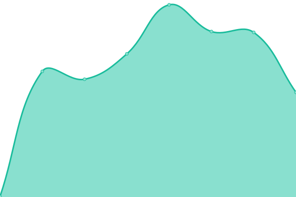
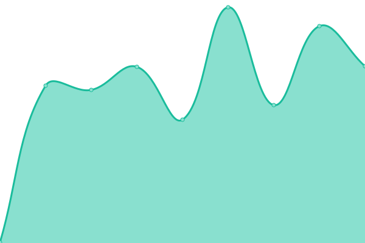
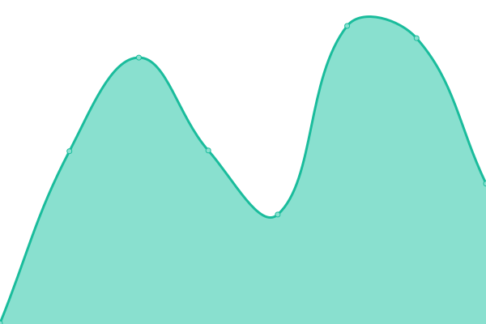
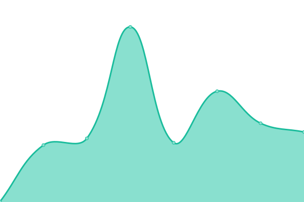
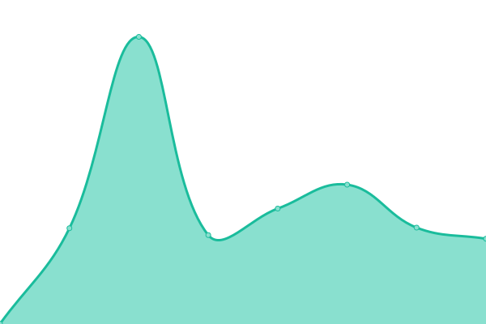

# [📈 Live Status](https://elightcap.github.io/statuspage): <!--live status--> **🟥 Complete outage**

This repository contains the open-source uptime monitor and status page for [elightcap](https://elightcap.github.io/statuspage), powered by [Upptime](https://github.com/upptime/upptime).

With [Upptime](https://upptime.js.org), you can get your own unlimited and free uptime monitor and status page, powered entirely by a GitHub repository. We use [Issues](https://github.com/elightcap/statuspage/issues) as incident reports, [Actions](https://github.com/elightcap/statuspage/actions) as uptime monitors, and [Pages](https://elightcap.github.io/statuspage) for the status page.

<!--start: status pages-->
<!-- This summary is generated by Upptime (https://github.com/upptime/upptime) -->
<!-- Do not edit this manually, your changes will be overwritten -->
<!-- prettier-ignore -->
| URL | Status | History | Response Time | Uptime |
| --- | ------ | ------- | ------------- | ------ |
|  [Jellyfin](https://jellyfin.elightcap.com) | 🟥 Down | [jellyfin.yml](https://github.com/elightcap/statuspage/commits/HEAD/history/jellyfin.yml) | 

 0ms
     
 | 

<a href="https://elightcap.github.io/statuspage/history/jellyfin">0.00%</a>
    

|  [Ombi](https://ombi.elightcap.com) | 🟥 Down | [ombi.yml](https://github.com/elightcap/statuspage/commits/HEAD/history/ombi.yml) | 

 0ms
     
 | 

<a href="https://elightcap.github.io/statuspage/history/ombi">0.00%</a>
    

|  [Sonarr](https://sonarr.elightcap.com) | 🟥 Down | [sonarr.yml](https://github.com/elightcap/statuspage/commits/HEAD/history/sonarr.yml) | 

 0ms
     
 | 

<a href="https://elightcap.github.io/statuspage/history/sonarr">0.00%</a>
    

|  [Radarr](https://radarr.elightcap.com) | 🟥 Down | [radarr.yml](https://github.com/elightcap/statuspage/commits/HEAD/history/radarr.yml) | 

 0ms
     
 | 

<a href="https://elightcap.github.io/statuspage/history/radarr">0.00%</a>
    

|  [Sabnzbd](https://sabnzbd.elightcap.com) | 🟥 Down | [sabnzbd.yml](https://github.com/elightcap/statuspage/commits/HEAD/history/sabnzbd.yml) | 

 0ms
     
 | 

<a href="https://elightcap.github.io/statuspage/history/sabnzbd">0.00%</a>
    

<!--end: status pages-->

[**Visit our status website →**](https://elightcap.github.io/statuspage)

## 📄 License

- Powered by: [Upptime](https://github.com/upptime/upptime)
- Code: [MIT](./LICENSE) © [elightcap](https://elightcap.github.io/statuspage)
- Data in the `./history` directory: [Open Database License](https://opendatacommons.org/licenses/odbl/1-0/)
